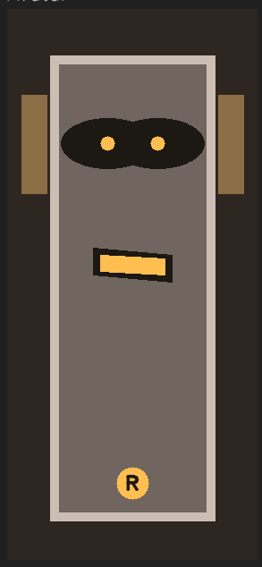
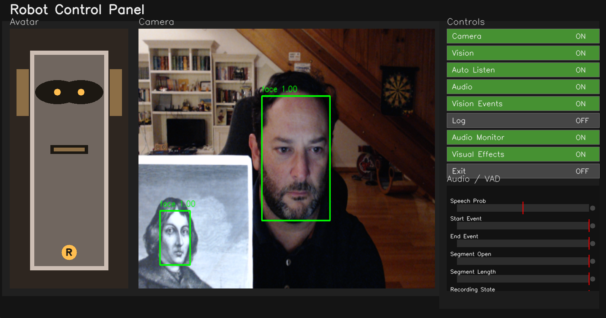
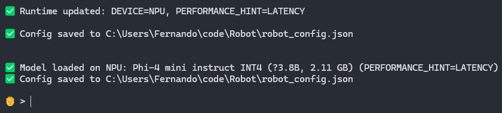
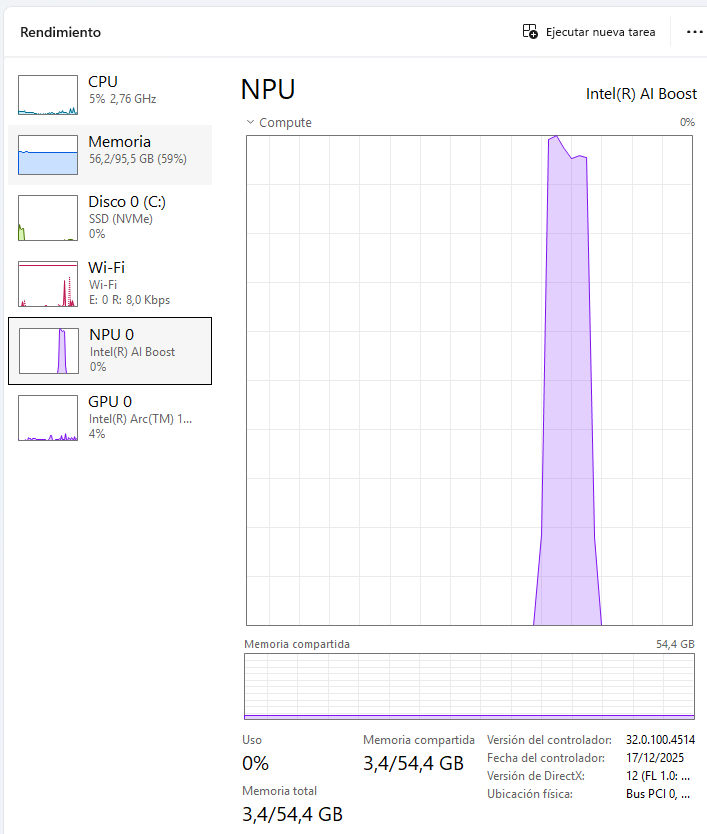
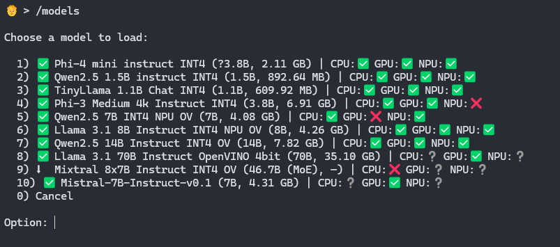
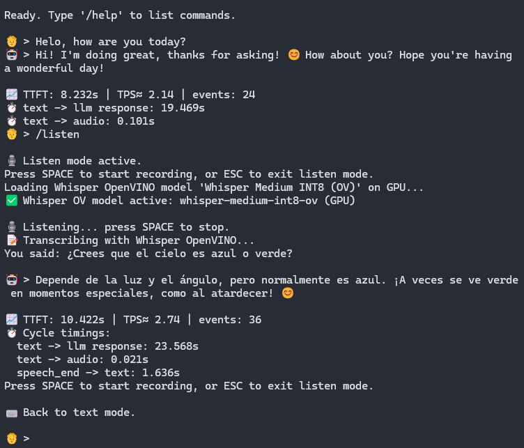

# Robot

|  | A cross-platform desktop conversational assistant for Windows and Linux that combines local or external LLMs, voice input, voice output, OpenVINO model utilities, and an optional camera/panel runtime. |
| --- | --- |

The core of the project is [`robot.py`](./robot.py). From an interactive console it can:

- load local LLMs from Hugging Face using OpenVINO GenAI
- use an external OpenAI-compatible model
- transcribe microphone input with classic Whisper or OpenVINO Whisper
- preload Whisper on startup to reduce first-use delay
- speak responses through multiple TTS backends
- run continuous auto-listen with Silero VAD
- react to camera presence events
- benchmark models and record metrics
- expose an OpenAI-compatible endpoint at `http://0.0.0.0:1311/v1/chat/completions`

## What The Project Does

`robot.py` works as an interactive REPL:

1. It loads configuration from [`robot_config.json`](./robot_config.json).
2. It loads model catalogs from `~/ov_models`.
3. It preloads the configured Whisper backend.
4. It tries to restore the previously used LLM.
5. It waits for commands (`/models`, `/panel`, `/listen`, `/config`, etc.) or regular prompts.
6. When it receives text:
   - it repeats it through TTS if `repeat=true`
   - otherwise it sends it to the active LLM and plays the response if audio is enabled

It also supports:

- manual `/listen` mode with `SPACE` start/stop and `ESC` exit
- continuous `/auto_listen on` mode with Silero VAD
- an optional `/panel` window for rendering the robot avatar, camera preview, toggles, and VAD bars
- headless camera/vision processing even when the panel is closed

## Presence And Panel

The optional control panel shows a robot avatar, camera area, runtime switches, and audio/VAD bars.



With a face detection model enabled, the assistant can:

- detect when people appear in the camera
- greet people when they arrive
- say contextual lines when the number of visible people changes
- say lines when it is left alone
- interrupt its own audio and say `me cayo` if everyone disappears from the camera while it is speaking

The camera worker is independent from the panel. That means `/camera on`, `/vision on`, and `/vision_events on` can keep running without rendering the panel window.

## Supported Backends

### LLM

- Local via `openvino_genai.LLMPipeline`
- External via an OpenAI-compatible API

### Speech-to-Text

- `openai-whisper`
- `openvino_genai.WhisperPipeline`
- Silero VAD for auto-listen segmentation

### Text-to-Speech

- Windows SAPI on Windows
- Parler-TTS on CPU
- OpenVINO Text2SpeechPipeline
- Kokoro ONNX
- BabelVox
- eSpeak NG

## Functionality Overview

- Local LLM chat through OpenVINO GenAI on CPU, GPU, NPU, or AUTO
- External LLM chat through an OpenAI-compatible endpoint
- Classic Whisper STT and OpenVINO Whisper STT
- Whisper preload on startup
- Continuous auto-listen with Silero VAD
- Streaming TTS while the LLM is still generating
- Multiple TTS backends: Windows SAPI, Parler, OpenVINO, Kokoro, BabelVox, eSpeak NG
- Optional control panel with robot avatar, camera preview, switches, and VAD bars
- Camera presence detection and reactive voice behavior
- Face detection through OpenVINO vision models
- Vision event logging and throttled console debugging
- Headless camera/vision processing without opening the panel
- Benchmarking and per-device compatibility tracking
- OpenAI-compatible local server on port `1311`
- OS-specific install scripts and requirements for Windows and Linux

## Important Files

- [`robot.py`](./robot.py): main application
- [`robot_config.json`](./robot_config.json): persisted configuration
- [`AGENTS.md`](./AGENTS.md): repository context for coding agents
- [`vision_models.json`](./vision_models.json): vision model catalog
- [`ov_models/models.json`](./ov_models/models.json): LLM model catalog

## Screenshots

### Phi-4 Loaded On The NPU

Example of the application after loading the Phi-4 model on the Intel NPU.



### NPU Usage

Example showing NPU usage while the assistant is running a model.



### Model List

The model selection list used to choose which LLM to load.



### Chat Example

Example of a chat session in the interactive console.



## Requirements

The repository ships OS-specific dependency files:

- [`requirements-windows.txt`](./requirements-windows.txt)
- [`requirements-linux.txt`](./requirements-linux.txt)

Also:

- `espeakng` requires the `espeak-ng` executable
- Linux also needs the system libraries required by `sounddevice` and PortAudio
- gated or private Hugging Face models use `~/ov_models/hf_auth.json`

Expected Hugging Face token format:

```json
{"hf_token":"hf_xxx"}
```

## Quick Start

Create and activate a compatible Python environment, install the dependencies for your OS, and then run the app.

### Windows

```powershell
pip install -r .\requirements-windows.txt
python .\robot.py
```

### Linux

Install `espeak-ng` and the PortAudio development/runtime packages with your package manager first, then:

```bash
pip install -r ./requirements-linux.txt
python ./robot.py
```

For a first session, the recommended flow is:

1. Run `/models`
2. Choose a local LLM or configure `/llm_backend external`
3. Adjust audio and STT settings with `/config`
4. Optionally run `/panel`
5. Optionally enable `/camera on`, `/vision on`, and `/vision_events on`
6. Try `/listen`, `/auto_listen on`, or type prompts directly

## Main Commands

```text
/help
/models
/add_model
/delete
/config
/voices
/llm_backend local|external
/tts_backend windows|parler|openvino|kokoro|babelvox|espeakng
/audio <on|off>
/audio_inputs
/audio_input_select
/audio_monitor <on|off>
/panel
/camera <on|off>
/vision <on|off>
/vision_events <on|off>
/vision_models
/vision_select
/vision_model
/vision_labels
/vision_device <name>
/log <on|off|seconds>
/repeat <true|false>
/listen
/auto_listen <on|off>
/whisper_models
/whisper_add
/whisper_select
/parler_models
/parler_add
/parler_select
/openvino_tts_models
/openvino_tts_add
/openvino_tts_select
/kokoro_models
/kokoro_select
/babelvox_models
/babelvox_select
/stats
/all_models
/clear_stats
/benchmark
/start_server
/exit
```

## Persisted Configuration

The main configuration lives in [`robot_config.json`](./robot_config.json). Among other things, it stores:

- LLM backend (`local` or `external`)
- current model and device (`CPU`, `GPU`, `NPU`, `AUTO`)
- TTS backend
- Whisper backend and model settings
- audio on/off
- TTS streaming
- system prompt
- `max_new_tokens`
- camera, panel, and vision options
- auto-listen and Silero VAD settings

Catalogs, metrics, and compatibility data live under `~/ov_models`.

## Tests

The automated test suite lives under [`tests`](./tests) and uses `pytest`.

Run:

```bash
pytest
```
